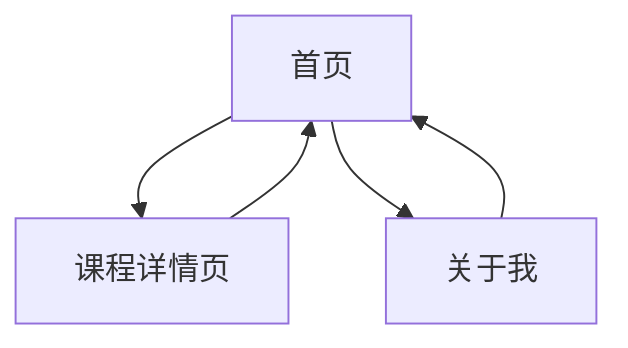

## 1. Product Overview
个人学习页面，展示TT同学的课程信息和学习内容。
- 主要用于展示广东科学技术职业学院商学院商务数据分析与应用专业的课程信息
- 目标用户为同学、老师和潜在雇主，展示专业能力和学习成果

## 2. Core Features

### 2.1 User Roles (if applicable)
| Role | Registration Method | Core Permissions |
|------|---------------------|------------------|
| Visitor | N/A | 浏览所有页面内容 |

### 2.2 Feature Module
1. **首页**: 个人简介、课程列表、联系方式
2. **课程详情页**: 课程内容、学习成果、相关资源
3. **关于我**: 个人介绍、专业背景、技能展示

### 2.3 Page Details
| Page Name | Module Name | Feature description |
|-----------|-------------|---------------------|
| 首页 | 个人简介 | 展示姓名、专业、学校信息，以及个人照片 |
| 首页 | 课程列表 | 展示所有课程卡片，包含课程名称、简介，点击进入详情页 |
| 首页 | 联系方式 | 提供邮箱、社交媒体等联系方式 |
| 课程详情页 | 课程内容 | 展示课程详细内容，包括学习目标、主要内容、学习成果 |
| 课程详情页 | 相关资源 | 提供课程相关的学习资源，如代码、文档、视频链接 |
| 关于我 | 个人介绍 | 详细介绍个人背景、学习经历、职业目标 |
| 关于我 | 技能展示 | 展示专业技能、工具掌握程度等 |

## 3. Core Process
用户访问首页，查看个人简介和课程列表，点击课程卡片进入课程详情页查看详细内容，或点击关于我页面了解更多个人信息。

## 4. User Interface Design
### 4.1 Design Style
- 主色调：蓝色 (#165DFF) 和白色 (#FFFFFF)，辅助色：浅灰 (#F5F7FA)
- 按钮风格：圆角矩形，轻微阴影
- 字体：无衬线字体，主标题 24px，副标题 18px，正文 14px
- 布局风格：卡片式布局，响应式设计
- 图标风格：简约线条图标

### 4.2 Page Design Overview
| Page Name | Module Name | UI Elements |
|-----------|-------------|-------------|
| 首页 | 个人简介 | 居中布局，个人照片圆形展示，姓名和专业信息清晰可见 |
| 首页 | 课程列表 | 网格布局，课程卡片包含课程名称、简短描述，悬停效果 |
| 首页 | 联系方式 | 底部固定，图标+文字组合 |
| 课程详情页 | 课程内容 | 左侧导航，右侧内容区，章节式展示 |
| 课程详情页 | 相关资源 | 卡片式展示，包含资源类型、名称、下载链接 |
| 关于我 | 个人介绍 | 分段式布局，清晰的标题和内容层次 |
| 关于我 | 技能展示 | 进度条或雷达图展示技能水平 |

### 4.3 Responsiveness
- 桌面优先设计，支持移动端自适应
- 断点设置：桌面 (>1200px)、平板 (768px-1200px)、手机 (<768px)
- 移动端优化：导航转为汉堡菜单，课程列表改为单列布局

### 4.4 3D Scene Guidance (if applicable)
- 不适用