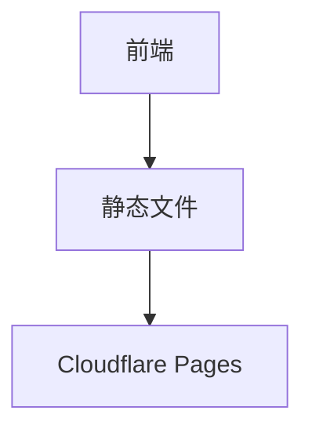

## 1. Architecture Design

## 2. Technology Description
- 前端：HTML5 + CSS3 + JavaScript + Tailwind CSS
- 初始化工具：无（纯静态项目）
- 后端：无
- 数据库：无

## 3. Route Definitions
| Route | Purpose |
|-------|---------|
| / | 首页 |
| /about | 关于我页面 |
| /courses/python-basic | Python基础课程详情页 |
| /courses/data-analysis | 数据分析技术课程详情页 |
| /courses/data-collection | 数据采集与处理课程详情页 |
| /courses/supply-chain | 供应链数据分析课程详情页 |
| /courses/database | 数据库原理与应用课程详情页 |

## 4. API Definitions (if backend exists)
- 不适用

## 5. Server Architecture Diagram (if backend exists)
- 不适用

## 6. Data Model (if applicable)
- 不适用